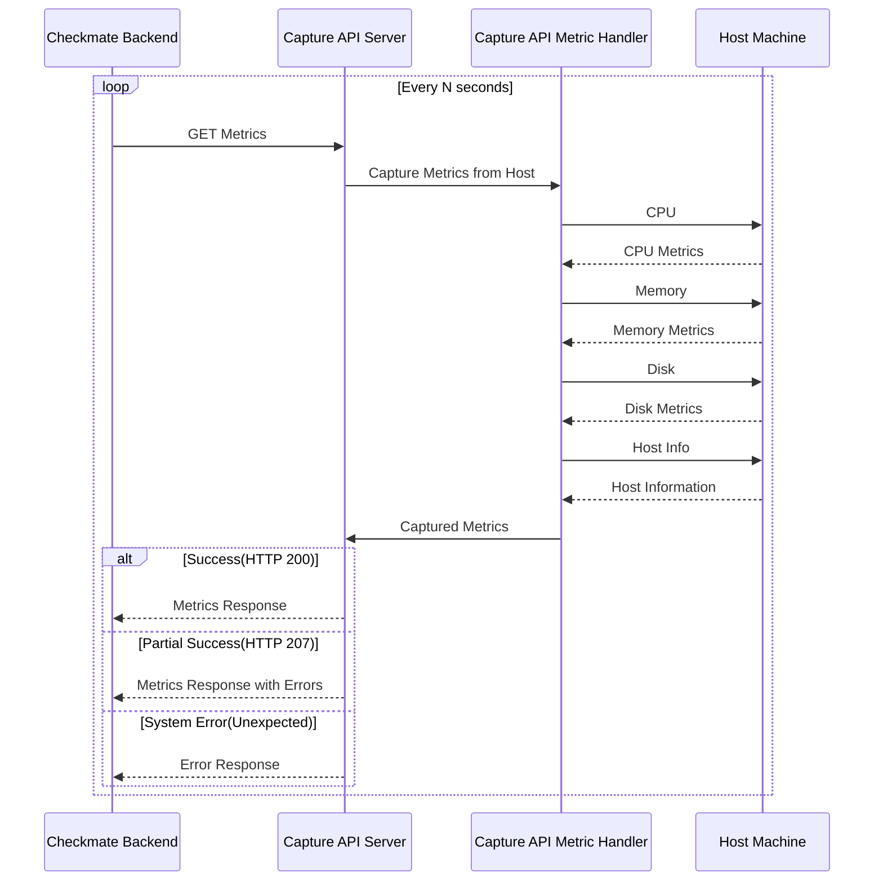

# Capture Documentation

## Table of Contents

- [Capture Documentation](#capture-documentation)
  - [Table of Contents](#table-of-contents)
  - [High Level Overview](#high-level-overview)

## High Level Overview

```mermaid
sequenceDiagram
    participant CHK as Checkmate Backend
    participant CAP as Capture API Server
    participant CAP_METRICS as Capture API Metric Handler

    participant HOST as Host Machine
    loop Every N seconds
        CHK->>CAP: GET Metrics
        CAP->>CAP_METRICS: Capture Metrics from Host
        # CPU
        CAP_METRICS->>HOST: CPU
        HOST-->>CAP_METRICS: CPU Metrics
        
        # Memory
        CAP_METRICS->>HOST: Memory
        HOST-->>CAP_METRICS: Memory Metrics
        
        # Disk
        CAP_METRICS->>HOST: Disk
        HOST-->>CAP_METRICS: Disk Metrics
        
        # Host Info
        CAP_METRICS->>HOST: Host Info
        HOST-->>CAP_METRICS: Host Information
        
        CAP_METRICS->>CAP: Captured Metrics
        alt Success(HTTP 200)
            CAP-->>CHK: Metrics Response
        else Partial Success(HTTP 207)
            CAP-->>CHK: Metrics Response with Errors
        else System Error(Unexpected)
            CAP-->>CHK: Error Response
        end
    end
```

## Systemd service

Systemd instructions are moved to [README.md](https://github.com/bluewave-labs/capture?tab=readme-ov-file#linux-systemd-service)
