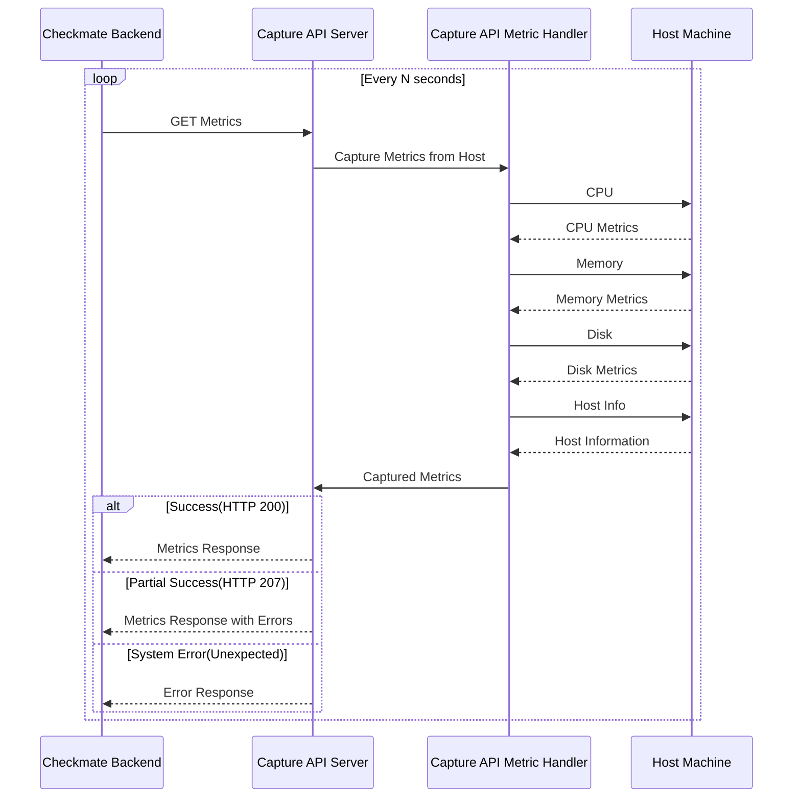

# Capture Documentation

## Table of Contents

- [Capture Documentation](#capture-documentation)
  - [Table of Contents](#table-of-contents)
  - [High Level Overview](#high-level-overview)
  - [Systemd service](#systemd-service)
    - [How to edit?](#how-to-edit)
    - [Setup](#setup)

## High Level Overview



## Systemd service

How can I run the Capture with systemd?

We provide you an example service file for systemd. You can find it in the `/docs/systemd/capture.service` file. Please don't forget to change the path, user, group and secret key in the service file.

### How to edit?

1. Open the `capture.service` file with your favorite text editor.

    ```shell
    nano systemd/capture.service
    ```

    or

    ```shell
    vim systemd/capture.service
    ```

2. Change the path, user, group and secret key in the service file.

    

    <p align="center">
        <i>Editing the systemd capture.service file</i>
    </p>

    - **ExecStart**: The path to the Capture executable file.
    - **Working Directory**: The path to the directory where the Capture is installed.
    - **User**: The user who will run the Capture.
    - **Group**: The group of the user who will run the Capture.

### Setup

1. Copy the `capture.service` file to `/etc/systemd/system/` directory.

    ```shell
    cp systemd/capture.service /etc/systemd/system/
    ```

2. Reload systemd with `systemctl daemon-reload`.

    ```shell
    systemctl daemon-reload
    ```

3. Start the service with `systemctl start capture`.

    ```shell
    systemctl start capture
    ```

4. Enable the service to start on boot with `systemctl enable capture`.

    ```shell
    systemctl enable capture
    ```

5. Check the status of the service with `systemctl status capture`.

    ```shell
    systemctl status capture
    ```

That's it! You have successfully set up the Capture with systemd. You can now start, stop, restart, enable, disable and check the status of the service with the `systemctl` command.

If you find any issues, please let us know by creating an issue on our [GitHub repository](https://github.com/bluewave-labs/capture/issues).
