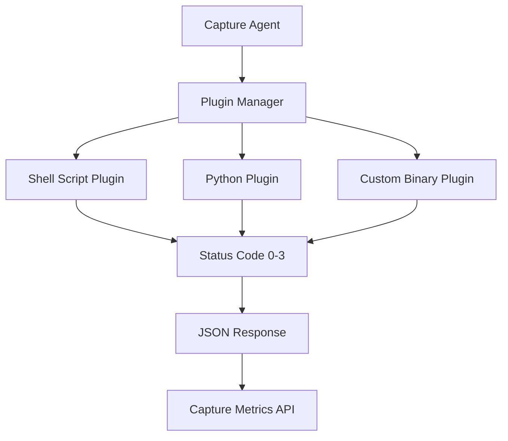

# Capture Plugin Development Guide

A comprehensive guide for adopting command line shell scripts as capture plugins with pre-defined configurations and status code conventions.

## Table of Contents

- [Overview](#overview)
- [Plugin Architecture](#plugin-architecture)
- [Status Code Convention](#status-code-convention)
- [Configuration Setup](#configuration-setup)
- [Plugin Development](#plugin-development)
- [Examples](#examples)
- [Best Practices](#best-practices)
- [Testing](#testing)
- [Troubleshooting](#troubleshooting)

## Overview

Capture plugins are external scripts or programs that extend the monitoring capabilities of the Capture system. They allow you to integrate custom monitoring logic, third-party tools, or specialized checks into your infrastructure monitoring workflow.

Plugins communicate with Capture through standardized exit codes and JSON responses, making them language-agnostic and easy to integrate.

## Plugin Architecture



### Plugin Flow

1. **Invocation**: Capture executes the plugin command at defined intervals
2. **Execution**: Plugin performs its monitoring logic
3. **Response**: Plugin returns a status code (0-3) and optional JSON body
4. **Integration**: Capture processes the response and includes it in metrics

## Status Code Convention

Plugins must return one of the following exit codes to indicate their status:

| Status Code | Meaning | Description | Use Case |
|-------------|---------|-------------|----------|
| `0` | **SUCCESS** | All systems operational | Service is healthy, metrics collected successfully |
| `1` | **WARNING** | Non-critical issues detected | Deprecated features, performance degradation, minor issues |
| `2` | **FAILURE** | Critical issues detected | Service down, connection failed, critical thresholds exceeded |
| `3` | **UNKNOWN** | Unable to determine status | Insufficient data, timeout, unexpected errors |

### JSON Response Format

Plugins should output a JSON response to stdout with the following structure:

```json
{
    "status_code": 0,
    "body": "Descriptive message about the check result",
    "metadata": {
        "timestamp": "2025-08-26T10:30:00Z",
        "plugin_version": "1.0.0",
        "execution_time_ms": 150
    },
    "metrics": {
        "custom_metric_1": 42.5,
        "custom_metric_2": "active"
    }
}
```

**Required Fields:**

- `status_code`: Integer (0-3) indicating the check result
- `body`: String describing the check result

**Optional Fields:**

- `metadata`: Additional information about the plugin execution
- `metrics`: Custom metrics to be included in Capture's response

## Configuration Setup

### Basic Plugin Configuration

Add plugins to your `capture.yaml` configuration file:

```yaml
# Capture configuration
version: "1"
server:
  port: 59232
  api_secret: "your-secret-key"

log_level: info

# Plugin configuration
plugins:
  - name: "database-health"
    command: "/opt/monitoring/scripts/check_database.sh"
    interval: "30s"
    timeout: "10s"
    retry_count: 2
    retry_delay: "5s"
    
  - name: "api-endpoint-check"
    command: "/usr/local/bin/python3 /opt/monitoring/scripts/api_health.py"
    interval: "1m"
    timeout: "15s"
    
  - name: "custom-service-monitor"
    command: "/opt/monitoring/bin/service_monitor --config /etc/service_monitor.conf"
    interval: "2m"
    timeout: "30s"
    environment:
      - "MONITOR_ENV=production"
      - "LOG_LEVEL=info"
```

### Configuration Options

| Option | Type | Required | Default | Description |
|--------|------|----------|---------|-------------|
| `name` | String | Yes | - | Unique identifier for the plugin |
| `command` | String | Yes | - | Command to execute the plugin |
| `interval` | Duration | No | "1m" | How often to execute the plugin |
| `timeout` | Duration | No | "30s" | Maximum execution time |
| `retry_count` | Integer | No | 1 | Number of retry attempts on failure |
| `retry_delay` | Duration | No | "5s" | Delay between retry attempts |
| `environment` | Array | No | [] | Environment variables for the plugin |

### Duration Format

Use Go duration format for time values:

- `30s` - 30 seconds
- `1m` - 1 minute
- `5m30s` - 5 minutes 30 seconds
- `1h` - 1 hour

## Plugin Development

### Shell Script Example

Create a basic health check plugin:

```bash
#!/bin/bash
# File: /opt/monitoring/scripts/database_check.sh

set -euo pipefail

# Configuration
DB_HOST="${DB_HOST:-localhost}"
DB_PORT="${DB_PORT:-5432}"
DB_USER="${DB_USER:-monitor}"
DB_NAME="${DB_NAME:-myapp}"

# Function to output JSON response
output_json() {
    local status_code=$1
    local message=$2
    local metrics=${3:-"{}"}
    
    cat << EOF
{
    "status_code": ${status_code},
    "body": "${message}",
    "metadata": {
        "timestamp": "$(date -u +%Y-%m-%dT%H:%M:%SZ)",
        "plugin_version": "1.0.0",
        "execution_time_ms": ${EXECUTION_TIME:-0}
    },
    "metrics": ${metrics}
}
EOF
}

# Record start time
START_TIME=$(date +%s%3N)

# Perform database connectivity check
if pg_isready -h "$DB_HOST" -p "$DB_PORT" -U "$DB_USER" -d "$DB_NAME" >/dev/null 2>&1; then
    # Get connection count
    CONN_COUNT=$(psql -h "$DB_HOST" -p "$DB_PORT" -U "$DB_USER" -d "$DB_NAME" -t -c "SELECT count(*) FROM pg_stat_activity;" 2>/dev/null | tr -d ' ')
    
    # Calculate execution time
    END_TIME=$(date +%s%3N)
    EXECUTION_TIME=$((END_TIME - START_TIME))
    
    # Check if connection count is within acceptable range
    if [ "$CONN_COUNT" -lt 100 ]; then
        METRICS='{"connection_count": '"$CONN_COUNT"', "max_connections": 100}'
        output_json 0 "Database is healthy with $CONN_COUNT active connections" "$METRICS"
        exit 0
    else
        METRICS='{"connection_count": '"$CONN_COUNT"', "max_connections": 100}'
        output_json 1 "Database connection count is high: $CONN_COUNT connections" "$METRICS"
        exit 1
    fi
else
    END_TIME=$(date +%s%3N)
    EXECUTION_TIME=$((END_TIME - START_TIME))
    output_json 2 "Unable to connect to database at $DB_HOST:$DB_PORT"
    exit 2
fi
```

### Python Example

```python
#!/usr/bin/env python3
# File: /opt/monitoring/scripts/api_health.py

import json
import sys
import time
import requests
from datetime import datetime, timezone

def output_json(status_code, message, metrics=None, execution_time=0):
    """Output standardized JSON response"""
    response = {
        "status_code": status_code,
        "body": message,
        "metadata": {
            "timestamp": datetime.now(timezone.utc).isoformat(),
            "plugin_version": "1.0.0",
            "execution_time_ms": execution_time
        }
    }
    
    if metrics:
        response["metrics"] = metrics
    
    print(json.dumps(response, indent=2))

def check_api_endpoint():
    """Check API endpoint health"""
    start_time = time.time() * 1000
    
    try:
        # Configuration
        api_url = "https://api.example.com/health"
        timeout = 10
        
        # Make request
        response = requests.get(api_url, timeout=timeout)
        execution_time = int((time.time() * 1000) - start_time)
        
        # Check response
        if response.status_code == 200:
            metrics = {
                "response_time_ms": execution_time,
                "status_code": response.status_code,
                "content_length": len(response.content)
            }
            output_json(0, f"API endpoint is healthy (HTTP {response.status_code})", metrics, execution_time)
            return 0
        else:
            metrics = {
                "response_time_ms": execution_time,
                "status_code": response.status_code
            }
            output_json(1, f"API endpoint returned HTTP {response.status_code}", metrics, execution_time)
            return 1
            
    except requests.exceptions.Timeout:
        execution_time = int((time.time() * 1000) - start_time)
        output_json(2, f"API endpoint timeout after {timeout}s", None, execution_time)
        return 2
        
    except requests.exceptions.ConnectionError:
        execution_time = int((time.time() * 1000) - start_time)
        output_json(2, "Unable to connect to API endpoint", None, execution_time)
        return 2
        
    except Exception as e:
        execution_time = int((time.time() * 1000) - start_time)
        output_json(3, f"Unexpected error: {str(e)}", None, execution_time)
        return 3

if __name__ == "__main__":
    sys.exit(check_api_endpoint())
```

### Go Binary Example

```go
// File: /opt/monitoring/src/service_monitor.go
package main

import (
    "encoding/json"
    "fmt"
    "os"
    "time"
)

type PluginResponse struct {
    StatusCode int                    `json:"status_code"`
    Body       string                 `json:"body"`
    Metadata   map[string]interface{} `json:"metadata,omitempty"`
    Metrics    map[string]interface{} `json:"metrics,omitempty"`
}

func outputJSON(statusCode int, message string, metrics map[string]interface{}, executionTime int64) {
    response := PluginResponse{
        StatusCode: statusCode,
        Body:       message,
        Metadata: map[string]interface{}{
            "timestamp":         time.Now().UTC().Format(time.RFC3339),
            "plugin_version":    "1.0.0",
            "execution_time_ms": executionTime,
        },
    }
    
    if metrics != nil {
        response.Metrics = metrics
    }
    
    output, _ := json.MarshalIndent(response, "", "  ")
    fmt.Println(string(output))
}

func checkService() int {
    startTime := time.Now()
    
    // Your service check logic here
    // This is a simple example
    
    serviceName := "my-service"
    
    // Simulate service check
    time.Sleep(100 * time.Millisecond)
    
    executionTime := time.Since(startTime).Milliseconds()
    
    // Mock service status check
    serviceRunning := true // Replace with actual check
    
    if serviceRunning {
        metrics := map[string]interface{}{
            "service_uptime_seconds": 3600,
            "memory_usage_mb":        256,
            "cpu_usage_percent":      15.5,
        }
        outputJSON(0, fmt.Sprintf("Service %s is running normally", serviceName), metrics, executionTime)
        return 0
    } else {
        outputJSON(2, fmt.Sprintf("Service %s is not running", serviceName), nil, executionTime)
        return 2
    }
}

func main() {
    os.Exit(checkService())
}
```

## Examples

### Example: Disk Space Monitor

```bash
#!/bin/bash
# File: /opt/monitoring/scripts/disk_check.sh

THRESHOLD=80
MOUNT_POINT="${1:-/}"

USAGE=$(df "$MOUNT_POINT" | tail -1 | awk '{print $5}' | sed 's/%//')

if [ "$USAGE" -lt "$THRESHOLD" ]; then
    echo '{"status_code": 0, "body": "Disk usage is normal ('$USAGE'%)", "metrics": {"disk_usage_percent": '$USAGE'}}'
    exit 0
elif [ "$USAGE" -lt 90 ]; then
    echo '{"status_code": 1, "body": "Disk usage is high ('$USAGE'%)", "metrics": {"disk_usage_percent": '$USAGE'}}'
    exit 1
else
    echo '{"status_code": 2, "body": "Disk usage is critical ('$USAGE'%)", "metrics": {"disk_usage_percent": '$USAGE'}}'
    exit 2
fi
```

### Example: SSL Certificate Check

```bash
#!/bin/bash
# File: /opt/monitoring/scripts/ssl_check.sh

DOMAIN="${1:-example.com}"
PORT="${2:-443}"

EXPIRY_DATE=$(echo | openssl s_client -connect "$DOMAIN:$PORT" -servername "$DOMAIN" 2>/dev/null | openssl x509 -noout -enddate 2>/dev/null | cut -d= -f2)

if [ -z "$EXPIRY_DATE" ]; then
    echo '{"status_code": 2, "body": "Unable to retrieve SSL certificate"}'
    exit 2
fi

EXPIRY_TIMESTAMP=$(date -d "$EXPIRY_DATE" +%s)
CURRENT_TIMESTAMP=$(date +%s)
DAYS_UNTIL_EXPIRY=$(( (EXPIRY_TIMESTAMP - CURRENT_TIMESTAMP) / 86400 ))

if [ "$DAYS_UNTIL_EXPIRY" -gt 30 ]; then
    echo '{"status_code": 0, "body": "SSL certificate is valid ('$DAYS_UNTIL_EXPIRY' days remaining)", "metrics": {"days_until_expiry": '$DAYS_UNTIL_EXPIRY'}}'
    exit 0
elif [ "$DAYS_UNTIL_EXPIRY" -gt 7 ]; then
    echo '{"status_code": 1, "body": "SSL certificate expires soon ('$DAYS_UNTIL_EXPIRY' days remaining)", "metrics": {"days_until_expiry": '$DAYS_UNTIL_EXPIRY'}}'
    exit 1
else
    echo '{"status_code": 2, "body": "SSL certificate expires very soon ('$DAYS_UNTIL_EXPIRY' days remaining)", "metrics": {"days_until_expiry": '$DAYS_UNTIL_EXPIRY'}}'
    exit 2
fi
```

## Best Practices

### Security

1. **Run with minimal privileges**: Use dedicated user accounts for plugin execution
2. **Validate inputs**: Sanitize any external inputs or configuration
3. **Secure credentials**: Use environment variables or secure credential stores
4. **File permissions**: Ensure plugin scripts have appropriate permissions (e.g., 755)

### Performance

1. **Set appropriate timeouts**: Prevent plugins from hanging indefinitely
2. **Implement connection pooling**: For database or API checks
3. **Cache results**: When appropriate to reduce external service load
4. **Resource cleanup**: Ensure proper cleanup of temporary files or connections

### Reliability

1. **Error handling**: Implement comprehensive error handling
2. **Graceful degradation**: Handle partial failures appropriately
3. **Logging**: Use structured logging for debugging
4. **Idempotency**: Ensure plugins can be run multiple times safely

### Code Quality

1. **Use shellcheck**: For shell scripts, use shellcheck for static analysis
2. **Follow language conventions**: Adhere to best practices for your chosen language
3. **Documentation**: Include inline comments and usage documentation
4. **Version control**: Track plugin versions and changes

### Example Plugin Template

```bash
#!/bin/bash
# Plugin Template
# Description: Template for creating Capture plugins
# Version: 1.0.0
# Author: Your Name

set -euo pipefail

# Configuration
PLUGIN_NAME="template-plugin"
PLUGIN_VERSION="1.0.0"

# Default values
DEFAULT_TIMEOUT=30
DEFAULT_RETRIES=3

# Helper functions
log() {
    echo "[$(date '+%Y-%m-%d %H:%M:%S')] $*" >&2
}

output_json() {
    local status_code=$1
    local message=$2
    local metrics=${3:-"{}"}
    
    cat << EOF
{
    "status_code": ${status_code},
    "body": "${message}",
    "metadata": {
        "timestamp": "$(date -u +%Y-%m-%dT%H:%M:%SZ)",
        "plugin_name": "${PLUGIN_NAME}",
        "plugin_version": "${PLUGIN_VERSION}",
        "execution_time_ms": ${EXECUTION_TIME:-0}
    },
    "metrics": ${metrics}
}
EOF
}

# Main check function
perform_check() {
    local start_time=$(date +%s%3N)
    
    # Your check logic here
    
    local end_time=$(date +%s%3N)
    EXECUTION_TIME=$((end_time - start_time))
    
    # Return appropriate status
    output_json 0 "Check completed successfully"
    return 0
}

# Error handling
trap 'output_json 3 "Plugin execution interrupted"; exit 3' INT TERM

# Main execution
main() {
    log "Starting $PLUGIN_NAME v$PLUGIN_VERSION"
    
    if perform_check; then
        log "Check completed successfully"
        exit 0
    else
        log "Check failed"
        exit 2
    fi
}

# Run main function if script is executed directly
if [[ "${BASH_SOURCE[0]}" == "${0}" ]]; then
    main "$@"
fi
```

## Testing

### Unit Testing

Test your plugins independently before integrating with Capture:

```bash
# Test plugin execution
./your_plugin.sh

# Check exit code
echo "Exit code: $?"

# Test with different scenarios
DB_HOST=invalid_host ./database_check.sh
```

### Integration Testing

```bash
# Test plugin with Capture configuration
capture --config test-config.yaml --dry-run

# Monitor plugin execution
tail -f /var/log/capture/plugins.log
```

### Automated Testing

```bash
#!/bin/bash
# File: test_plugins.sh

PLUGINS_DIR="/opt/monitoring/scripts"
TEST_RESULTS=()

for plugin in "$PLUGINS_DIR"/*.sh; do
    echo "Testing: $plugin"
    
    if timeout 30s "$plugin" >/dev/null 2>&1; then
        echo "✓ $plugin passed"
        TEST_RESULTS+=("PASS: $(basename "$plugin")")
    else
        echo "✗ $plugin failed"
        TEST_RESULTS+=("FAIL: $(basename "$plugin")")
    fi
done

echo "Test Results:"
printf '%s\n' "${TEST_RESULTS[@]}"
```

## Troubleshooting

### Common Issues

1. **Plugin not executing**
   - Check file permissions (should be executable)
   - Verify the command path in configuration
   - Ensure required dependencies are installed

2. **Timeout errors**
   - Increase timeout value in configuration
   - Optimize plugin performance
   - Check for hanging processes

3. **Invalid JSON output**
   - Validate JSON format using `jq`
   - Ensure no extra output to stdout
   - Use stderr for logging/debugging

4. **Environment issues**
   - Check required environment variables
   - Verify PATH includes necessary binaries
   - Test plugin in isolation

### Debug Mode

Add debug output to your plugins:

```bash
if [[ "${DEBUG:-false}" == "true" ]]; then
    set -x
    log "Debug mode enabled"
fi
```

### Logging

Configure appropriate logging in your plugins:

```bash
# Log to syslog
logger -t "$PLUGIN_NAME" "Check completed with status: $status"

# Log to file
echo "[$(date)] Check result: $status" >> "/var/log/capture-plugins/$PLUGIN_NAME.log"
```

### Monitoring Plugin Health

Create a meta-plugin to monitor other plugins:

```bash
#!/bin/bash
# File: plugin_health_monitor.sh

PLUGINS_DIR="/opt/monitoring/scripts"
FAILED_PLUGINS=()

for plugin in "$PLUGINS_DIR"/*.sh; do
    if ! timeout 10s "$plugin" >/dev/null 2>&1; then
        FAILED_PLUGINS+=("$(basename "$plugin")")
    fi
done

if [[ ${#FAILED_PLUGINS[@]} -eq 0 ]]; then
    output_json 0 "All plugins are healthy"
    exit 0
else
    output_json 1 "Some plugins are failing: ${FAILED_PLUGINS[*]}"
    exit 1
fi
```

---

This guide provides a comprehensive foundation for developing and integrating command line shell scripts as Capture plugins. The standardized status codes and JSON response format ensure consistent integration with the Capture monitoring system.

For more information, refer to the [Capture documentation](https://github.com/bluewave-labs/capture) and join our [Discord community](https://discord.com/invite/NAb6H3UTjK) for support and discussions.
